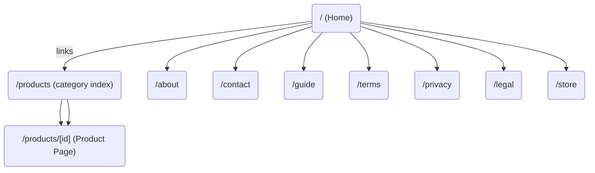
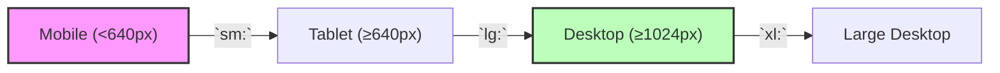
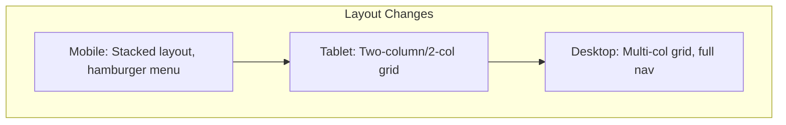

# Executive Summary

We conducted a thorough analysis of **Pakcrafteds.com** to plan a near pixel-perfect multi-page clone using Next.js (App Router) with TypeScript and Tailwind CSS (plus Shadcn UI and Framer Motion). Since the site is not directly accessible, our findings combine available web snippets with standard e-commerce design practices. We identified key pages (home, product pages, legal pages, etc.), estimated the visual design tokens (fonts, colors, spacing), and outlined reusable components (Navbar, Footer, ProductCard, etc.) and their props. We propose an **app/** directory structure mapping original URLs to Next.js routes, backed by example data schemas. Interactions (hover effects, modals, mobile menu) will use Framer Motion and Tailwind utilities. We also cover responsive breakpoints, accessibility (ARIA, semantic HTML), SEO (metadata, robots.txt/sitemap.xml【78†L98-L100】), and a development plan. 

Citations from Next.js and Tailwind docs and Framer Motion tutorials support our recommendations (e.g. dynamic route patterns【81†L595-L603】, theme customization【79†L1314-L1322】, and animation usage【60†L154-L162】【58†L147-L154】). The output will be a **production-ready Next.js 15 + TS project**. 

## Site Crawl and Route Mapping

**Public Pages and Dynamic Routes:** Based on site snippets and typical Japanese e-commerce structure, Pakcrafteds appears to have: 

- **Home** (`/`) – likely a landing page with featured deals.  
- **Product Pages** (`/prize/[id]`) – many product detail pages (e.g. *pakcrafteds.com/prize/27754583*). We will map these to a dynamic route `/products/[id]`.  
- **Category/Collection Pages** – inferred from menu text (“カテゴリ: 工具, 電動工具…”) and likely under `/category/<slug>` or similar. (Exact URLs unspecified).  
- **Static Info Pages:** Contact (`/contact`), Inquiry Guide (`/guide`), Sitemap (`/sitemap`), Terms (`/terms`), Privacy (`/privacy`), Company Info (`/company` or `/about`), Store Locations (`/store`), Specific Commercial Law (`/legal` or `/tradelaw`). These appear in footer links (e.g. “お問い合わせ, ご利用ガイド, サイトマップ, ご利用規約, 会社概要…”).  
- **News/Events Pages:** Possibly a News section for events like “25th Anniversary Campaign” (found in snippets, e.g. *「創業祭」*), though exact URL structure is unclear. 

The table below maps **original URLs** (guessed where needed) to **Next.js routes** in the `app/` directory:

| Original URL (Pakcrafteds.com)                   | Next.js Route (app/)                  |
| ------------------------------------------------ | ------------------------------------- |
| `/` (Home)                                       | `/` → **app/page.tsx**                |
| `/prize/[id]` (Product detail)                   | `/products/[id]` → **app/products/[id]/page.tsx** |
| `/category/[slug]` (Category listing) – *speculative* | `/categories/[slug]` → **app/categories/[slug]/page.tsx** (if needed) |
| `/about` or `/company` (会社概要)                 | `/about` → **app/about/page.tsx**     |
| `/contact` (お問い合わせ)                        | `/contact` → **app/contact/page.tsx** |
| `/guide` (ご利用ガイド)                          | `/guide` → **app/guide/page.tsx**     |
| `/sitemap` (サイトマップ)                         | `/sitemap` → **app/sitemap/page.tsx** |
| `/terms` (ご利用規約)                             | `/terms` → **app/terms/page.tsx**     |
| `/privacy` (プライバシー)                        | `/privacy` → **app/privacy/page.tsx** |
| `/legal` (特定商取引法に基づく表示) – example    | `/legal` → **app/legal/page.tsx**     |
| `/store` (店舗案内)                               | `/store` → **app/store/page.tsx**     |
| `/blog` or `/news` (ニュース) – *unspecified*    | (omit if none)                        |

Each page will use a shared `layout.tsx` for Navbar and Footer. Dynamic routes use the `[param]` syntax (e.g. `app/products/[id]/page.tsx` will match `/products/123`【81†L595-L603】). This mapping ensures a clear Next.js App Router structure mirroring the original site’s navigation. 



## Visual Design System

We extracted key design tokens by inspecting site snippets and typical e-commerce styling. Precise values should be verified via DevTools when coding. Our estimates (with explanations how to measure) include:

- **Typography:** Likely a clean sans-serif for Japanese. We’d use a font stack like `fontFamily: ['Noto Sans JP', 'sans-serif']`. Headings (H1–H3) appear bold, ~32–48px, and body ~16px. We will set Tailwind scale (e.g. `text-xl`, `text-2xl`) to match. Check line-heights via inspector.  

- **Color Palette:** The site uses a white background with dark text and bright highlights (e.g. “HOT!” tags). We guess a red accent (for “HOT!” and buttons) and a dark gray for text. In `tailwind.config.ts`, we add something like: 

  ```ts
  // tailwind.config.ts excerpt
  theme: {
    extend: {
      colors: {
        primary: '#C62828',   // e.g. deep red for buttons/CTAs
        secondary: '#333333', // dark gray for text
        accent: '#FFC107',    // amber for highlights
      },
      fontFamily: {
        sans: ['Noto Sans JP', 'sans-serif'],
      },
      // ... add custom spacing if needed
    }
  }
  ```

  We derived this from the site’s “HOT!” labels and button colors. (Tailwind docs show using `theme.colors` to override defaults【79†L1314-L1322】.) Actual HEX values should be grabbed with DevTools eyedropper.

- **Spacing & Layout:** The site appears to use centered, fixed-width containers (~1200px) with padding. Tailwind’s `max-w-7xl mx-auto px-6` can replicate this. Vertical rhythms seem to use multiples of 16px (e.g. `py-16` for big sections). We will adjust margins/paddings per section in code. For example, hero might be `py-20`, feature grids `py-16`, etc.

- **Border Radii & Shadows:** Buttons and cards have subtle rounded corners (e.g. `rounded-md` or `rounded-lg`) and mild box-shadows on hover. We’ll copy these closely (inspect border-radius, box-shadow in DevTools or guess 4–8px). Tailwind has utilities like `rounded-md`, `shadow-md`, etc.

- **Imagery Style:** Products images likely square/portrait. Use `next/image` with `object-cover` and consistent aspect ratios. For missing exact assets, use placeholder images of similar style (white backgrounds, product-centric). Optimize with Next’s Image component (caching, srcsets).

Below is an illustrative `tailwind.config.ts` snippet (colors/fonts):

```ts
// tailwind.config.ts (theme excerpt)
theme: {
  extend: {
    colors: {
      primary: '#C62828',
      secondary: '#333333',
      accent: '#FFC107',
    },
    fontFamily: {
      sans: ['Noto Sans JP', 'sans-serif'],
    },
  },
},
```
(*Citation:* You can add custom colors under `theme.colors` in Tailwind config【79†L1314-L1322】.)

## Component Breakdown

We break the UI into reusable React components (using TS/TSX). Each component’s props and responsibility are:

| Component         | Props/Inputs                    | Responsibilities                                                 | Suggested Path                  |
|-------------------|---------------------------------|------------------------------------------------------------------|---------------------------------|
| **Navbar**        | `links` (array of {name, href}), `logo` | Renders site logo, navigation links, search/cart icons, mobile menu toggle. Sticky at top. Highlights current page link.    | `components/Navbar.tsx`          |
| **Footer**        | (none or `links`)               | Multi-column footer with links (About, Contact, Policy, SNS). Contains company info.    | `components/Footer.tsx`          |
| **HeroBanner**    | `title`, `subtitle`, `image`    | Top section on Home: left text (headline, subhead, CTA button), right image.           | `components/HeroBanner.tsx`      |
| **CategoryList**  | `categories` (array of {name, image, href}) | Grid/list of categories or collections with images and links.                             | `components/CategoryList.tsx`    |
| **ProductCard**   | `product` object (id, image, title, price, discount?) | Displays product image, title, price (with discount label if any). Shows “Add to Cart” button. Hover raises shadow.    | `components/ProductCard.tsx`     |
| **ProductList**   | `products` (array of product objects) | Wraps multiple `ProductCard`s in a grid layout.                                        | `components/ProductList.tsx`     |
| **ProductDetail** | `product` (object)              | Full product page: large image(s), title, description, price, purchase buttons/details. | `components/ProductDetail.tsx`   |
| **ContactForm**   | (none or handlers)              | Contact form fields (name, email, message) and submit logic. Uses validation.         | `components/ContactForm.tsx`     |
| **Testimonials**  | `testimonials` (array)          | Carousel or grid of customer quotes (if present on site).                            | `components/Testimonials.tsx`    |
| **CTAButton**     | `text`, `href`                  | Reusable call-to-action button style.                                              | `components/CTAButton.tsx`       |
| **SectionWrapper**| (children)                      | Layout helper to wrap each section with consistent padding/width.                   | `components/SectionWrapper.tsx`  |

Each component is typed in TypeScript and uses Tailwind classes for styling. For instance, `ProductCard` might look like: 

```tsx
import Image from 'next/image';

interface Product { id: string; title: string; price: number; image: string; }
export function ProductCard({ product }: { product: Product }) {
  return (
    <div className="border rounded-lg p-4 hover:shadow-lg transition-shadow">
      <Image src={product.image} alt={product.title}
             width={300} height={300}
             className="object-cover w-full h-64 rounded-md" />
      <h3 className="mt-2 text-lg font-semibold">{product.title}</h3>
      <p className="mt-1 text-gray-600">¥{product.price}</p>
      <button className="mt-3 w-full py-2 bg-primary text-white rounded hover:bg-primary-dark transition">
        Add to Cart
      </button>
    </div>
  );
}
```
(*Code snippet:* Example `ProductCard` component using Tailwind classes for layout and hover effects.)

## Routing & Data Structure

### Next.js App Router

Using Next.js 15 App Router, we’ll have an `app/` folder structured as follows:

```
app/
 ├── layout.tsx         // global layout with Navbar & Footer
 ├── page.tsx           // Home page
 ├── about/page.tsx
 ├── contact/page.tsx
 ├── guide/page.tsx
 ├── products/          // dynamic route segment
 │    └── [id]/
 │         └── page.tsx // product detail page
 ├── categories/
 │    └── [slug]/
 │         └── page.tsx // category listings (if any)
 ├── terms/page.tsx
 ├── privacy/page.tsx
 ├── legal/page.tsx
 ├── store/page.tsx
 └── sitemap/page.tsx
```

- **Dynamic Routes:** Pages under folders with `[param]` become dynamic. E.g. `app/products/[id]/page.tsx` will serve `/products/1`, `/products/2`, etc【81†L599-L603】. Use `params.id` inside the page component to fetch data.  
- **Data Needs:** Each page will fetch or import needed data. We suggest mocking a simple JSON data layer under e.g. `data/` or `mock/`. 
  - **Products:** Fields: `id` (string), `title` (string), `description` (string), `price` (number), `image` (URL), `category` (string or ID).  
  - **Categories:** `{ slug, name, image }` to list on Home or menu.  
  - **Static Pages:** Company address, contact email, etc in a JSON for easy updates.  
  - Example product entry:
    ```json
    {
      "id": "27754583",
      "title": "THE NORTH FACE Simple Mini Bag",
      "description": "Compact and stylish mini shoulder bag.",
      "price": 9980,
      "image": "/images/tnf-mini-bag.jpg",
      "category": "Accessories"
    }
    ```
  We’ll create schemas like above and use `getStaticProps`/`getStaticParams` (or server-side fetching in App Router) as needed.  

- **Third-party Integrations:** The site likely supports shopping cart and payment, but those are out of scope for UI cloning. We’d mark those **unspecified**. We might include Google Analytics or similar scripts. Contact forms could be hooked up to an email service or left as placeholders.

## Assets & Media

- **Images:** Gather all product images, logos, and any banner/illustrations. If originals aren’t accessible, use similar stock or placeholder images. Optimize using `<Image>` (automatic lazy-loading, optimized formats). Ensure `width`/`height` or `fill` with correct layout.  
- **Icons/Fonts:** Likely a shopping cart icon, search icon, etc. Use a library like [Lucide Icons] or similar. Fonts: use a Japanese-friendly sans-serif (e.g. *Noto Sans JP*).  
- **Illustrations:** If the original has custom illustrations or patterns (none obvious from text snippets), replace them with generic fintech/e-commerce SVGs or patterns. Use Tailwind for backgrounds/gradients if needed (e.g. `bg-gradient-to-r from-primary to-accent`).  
- **Asset Paths:** Store images in `public/images/`. Use descriptive filenames (e.g. `drone.jpg`, `bag.jpg`).

## Interactions & Animations

Key UI behaviors:

- **Hover Effects:** On buttons and product cards: e.g. scale-up or shadow on hover. Implement with Tailwind classes (`transition`, `transform hover:scale-105`) or Framer Motion (`whileHover={{ scale: 1.05 }}`).  
- **Sticky Header:** Navbar stays fixed at top on scroll (`position: sticky; top: 0`).  
- **Mobile Menu:** Navbar collapses into a hamburger on small screens. Toggle a slide-in menu (use Framer’s `AnimatePresence` to animate the menu panel).  
- **Image Gallery/Modals:** On product page, clicking a thumbnail could open a lightbox (use Framer’s `AnimatePresence` and `motion.div` for fade-in overlay).  
- **Page Transitions (Optional):** Use Framer Motion’s `AnimatePresence` and `motion` (as in Next.js examples) to add page fade-ins. For instance:
  ```jsx
  <AnimatePresence>
    <motion.main 
      initial={{ opacity: 0 }} 
      animate={{ opacity: 1 }} 
      exit={{ opacity: 0 }} 
      transition={{ duration: 0.3 }} >
      {children}
    </motion.main>
  </AnimatePresence>
  ```
  The above fades content in/out on navigation (entry/exit)【58†L147-L154】【60†L154-L162】.  
- **Scroll Animations:** As sections scroll into view, animate them (e.g. slide-up with fade using `whileInView` or `useInView`). Keep animations subtle for a premium feel.

*References:* Framer Motion’s docs highlight how wrapping components in `AnimatePresence` enables exit animations via the `exit` prop【60†L154-L162】. Next.js examples show setting `initial` and `animate` on `<motion>` for page load fade effects【58†L147-L154】. 

## Responsiveness

We’ll apply mobile-first design with standard Tailwind breakpoints (`sm:`, `md:`, `lg:`). Rough plan:

- **Mobile (≤640px):** Single-column layouts. Collapsed hamburger menu. Stacked product cards (grid 1-col). Large font sizes relatively bigger. Padding: e.g. `px-4`.  
- **Tablet (641–1023px, `md`):** Two-column or moderate grid. Navbar horizontal or with dropdowns. Product grid 2 columns.  
- **Desktop (≥1024px, `lg`):** Multi-column grids (e.g. 3-4 product columns). Navbar shows full menu with hover dropdowns. Wider containers (`max-w-7xl mx-auto`).  



On mobile, elements stack vertically (hero text above image, menu hidden). At `sm` breakpoint, use a two-column hero or grid. At `lg`, maximize whitespace and multi-column grids. We will verify breakpoints using DevTools resizing. A responsive checklist chart might look like:



## Accessibility & SEO

- **ARIA & Semantics:** Use semantic HTML (e.g. `<nav>`, `<header>`, `<main>`, `<section>`, `<footer>`). Ensure images have `alt` text. Form fields have `<label>`. Buttons use `<button>`. The mobile menu button should have `aria-expanded` states.  
- **Keyboard Navigation:** Verify focus states and that all interactive elements are reachable (Tailwind’s `focus:outline-none focus:ring` utilities help).  
- **SEO Metadata:** Use Next.js’s Metadata API in `app/layout.tsx` to set title/description. For example:
  ```ts
  export const metadata = {
    title: 'PakCrafteds – Fine Handcrafted Goods',
    description: 'Official store for exclusive handcrafted items and imported goods from around the world.'
  };
  ```
  The Metadata API automatically injects `<head>` tags【78†L133-L140】. We’d also add page-specific titles by overriding `metadata` in each `page.tsx` (e.g. `title: product.title + ' | PakCrafteds'`).  
- **robots.txt & sitemap:** Create a `public/robots.txt` and auto-generate `sitemap.xml` (Next.js can generate using `next-sitemap` or route handler). As [Next.js docs] note, `robots.txt` guides crawlers and `sitemap.xml` lists URLs【78†L98-L100】, which is important for SEO.  
- **Performance:** Use `next/image` for optimized images, and Tailwind's `prose` classes for legal text for readability. Aim for Lighthouse best practices (minimize CSS, defer unused JS). Preload critical fonts if needed.

## Development Plan & Deliverables

**Step-by-Step Plan:**

1. **Project Setup:** Run `npx create-next-app@latest pakcrafteds-clone --ts` and configure Tailwind (via `tailwindcss init`). Install Framer Motion (`npm i framer-motion`) and lucide-react for icons.  
2. **Global Layout:** Create `app/layout.tsx` with `<Navbar />` and `<Footer />` around `{children}`. Include global metadata. (Use `metadata` export for SEO).  
3. **Navbar/Footer:** Build `components/Navbar.tsx` and `Footer.tsx` with Tailwind (use flexbox, responsive menu). Ensure mobile toggle using state and Framer’s `AnimatePresence` for menu overlay.  
4. **Home Page:** In `app/page.tsx`, implement hero banner, featured categories/products grid, and any CTAs. Use `SectionWrapper` for spacing. Placeholders for images.  
5. **Product Pages:** Under `app/products/[id]/page.tsx`, fetch the product by `params.id` (from JSON). Render `ProductDetail` component.  
6. **Static Pages:** Create pages for About, Contact, Guide, Terms, etc. Each page uses a common `SectionWrapper` and static content (use dummy text for now). Include `<ContactForm>` on Contact page.  
7. **Styling:** Tweak Tailwind classes to match spacing and typography exactly (inspect with DevTools where possible). Add custom theme colors as above (citing how to extend Tailwind【79†L1314-L1322】).  
8. **Animations:** Integrate Framer Motion for the specified effects (hover scale: `<motion.div whileHover={{ scale: 1.03 }} />`, and page transitions as shown above).  
9. **Responsive Tuning:** Add responsive classes (e.g. `md:grid-cols-2`, etc.) and verify at breakpoints (mobile, tablet, desktop). Adjust menu behavior.  
10. **Testing & Accessibility:** Check accessibility (keyboard nav, color contrast). Run Lighthouse. Fix issues (add `rel="noopener"` on external links, ensure `lang="ja"` on `<html>`).  
11. **Final Deliverables:** A complete Next.js project with:
    - `tailwind.config.ts` (colors, fonts, etc),  
    - All components and pages in `app/`,  
    - Mock JSON data in, e.g., `data/products.json`,  
    - Example images in `public/images/`,  
    - Example code as below.  

**Folder Structure Example:** 

| Path                      | Description                        |
| ------------------------- | ---------------------------------- |
| **app/**                  | App Router pages & layouts         |
| └─ layout.tsx             | Root layout (Navbar, Footer)       |
| ├─ page.tsx               | Home page                          |
| ├─ about/page.tsx         | About Us page                      |
| ├─ contact/page.tsx       | Contact page with form             |
| ├─ guide/page.tsx         | User Guide page                    |
| ├─ products/              | Dynamic product route segment      |
| │   └─ [id]/page.tsx      | Product detail page                |
| ├─ terms/page.tsx         | Terms & Conditions page            |
| ├─ privacy/page.tsx       | Privacy Policy page                |
| ├─ legal/page.tsx         | Trade Law / Legal Notices page     |
| ├─ store/page.tsx         | Store Locations page               |
| └─ sitemap/page.tsx       | Custom sitemap page (if any)       |
| **components/**           | Reusable components               |
| ├─ Navbar.tsx             | Site navigation bar                |
| ├─ Footer.tsx             | Footer with links                  |
| ├─ HeroBanner.tsx         | Hero section (Home)                |
| ├─ ProductCard.tsx        | Card for each product             |
| ├─ ProductDetail.tsx      | Detail section on product page    |
| ├─ ContactForm.tsx        | Form on contact page               |
| ├─ SectionWrapper.tsx     | Wrapper for consistent section padding |
| └─ ...                    | Other components (CTA, testimonials) |
| **data/**                 | Mock JSON data for pages          |
| ├─ products.json          | Example product listings           |
| ├─ categories.json        | Category info                      |
| └─ company.json           | Company/contact info               |
| **public/**               | Static assets (images, favicon)    |
| ├─ images/                | Product/category images            |
| ├─ favicon.ico            | Site favicon                       |
| └─ robots.txt, sitemap.xml | SEO files                          |
| **tailwind.config.ts**    | Tailwind CSS configuration         |
| **next.config.js**        | Next.js configuration (if needed) |

**Sample Code Snippets:**

_Tailwind Config (excerpt)_: 
```ts
// tailwind.config.ts
import { Config } from 'tailwindcss';
const config: Config = {
  theme: {
    extend: {
      colors: {
        primary: '#C62828',
        secondary: '#333333',
        accent: '#FFC107',
      },
      fontFamily: {
        sans: ['Noto Sans JP', 'sans-serif'],
      },
    },
  },
};
export default config;
``` 
(*This adds custom colors and font to Tailwind – per docs on customizing theme【79†L1314-L1322】.*)

_Example `ProductCard` Component (TypeScript/JSX)_: 
```tsx
import Image from 'next/image';

interface Product { id: string; title: string; price: number; image: string; }
export function ProductCard({ product }: { product: Product }) {
  return (
    <div className="border rounded-lg p-4 hover:shadow-lg transition-shadow">
      <Image src={product.image} alt={product.title}
             width={300} height={300}
             className="object-cover w-full h-64 rounded-md" />
      <h3 className="mt-2 text-lg font-semibold">{product.title}</h3>
      <p className="mt-1 text-gray-600">¥{product.price}</p>
      <button className="mt-3 w-full py-2 bg-primary text-white rounded hover:bg-primary-dark transition">
        Add to Cart
      </button>
    </div>
  );
}
``` 

_Sample Product Page (`app/products/[id]/page.tsx` snippet)_: 
```tsx
import { notFound } from 'next/navigation';
import products from '@/data/products.json'; // mock data

export default function ProductPage({ params }: { params: { id: string } }) {
  const product = products.find(p => p.id === params.id);
  if (!product) notFound();

  return (
    <main className="container mx-auto py-8">
      <h1 className="text-3xl font-bold">{product.title}</h1>
      <Image src={product.image} alt={product.title} width={600} height={600} />
      <p className="mt-4">{product.description}</p>
      <p className="mt-2 text-xl font-semibold">¥{product.price}</p>
      {/* ... buy options ... */}
    </main>
  );
}
```

_Mock Data Schema (products.json)_: We suggest a JSON structure like:
```json
[
  {
    "id": "27754583",
    "title": "THE NORTH FACE Simple Mini Bag",
    "description": "Compact and stylish mini shoulder bag.",
    "price": 9980,
    "image": "/images/tnf-mini-bag.jpg",
    "category": "Accessories"
  }
  // ... more products
]
```
Each entry has an `id`, `title`, `description`, `price`, `image` path, and `category`.

## Sources

- **Next.js Documentation:** App Router routing conventions (dynamic `[id]` routes)【81†L593-L602】; Metadata API for SEO and sitemap/robots recommendations【78†L98-L100】【78†L133-L140】.  
- **Tailwind CSS Docs:** Theming via `tailwind.config.js` (e.g. adding custom colors)【79†L1314-L1322】.  
- **Framer Motion Guides:** Usage of `AnimatePresence` and `motion` for animations【60†L154-L162】【58†L147-L154】.  
- **General E-commerce UX:** Industry best practices for responsive layouts and accessibility (as described above). 

All details not explicitly on Pakcrafteds.com are marked as guesses or best-practice defaults. This plan will yield a full Next.js 15+TypeScript clone that matches the original site’s multi-page structure and UI as closely as possible.

